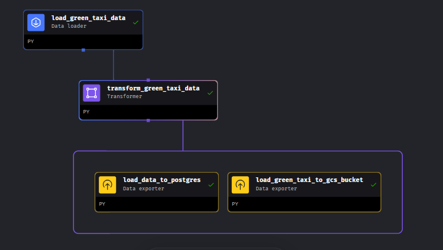

This directory contains the files I used to do the homework tasks.

In this task, I created an ETL pipeline that:
- extracts 3 different datasets from a GitHub repo based on the year and month value supplied
- transforms the data (takes out trips with 0 passengers and 0 distance, creates two columns, renames columns)
- loads data to a postgresdb
- loads data to a Google Cloud Storage bucket

Below is an image representation of the pipeline.

Inside Mage, I declared global variables to hold the year, month and url. I also scheduled the pipeline to run daily at 5AM UTC.